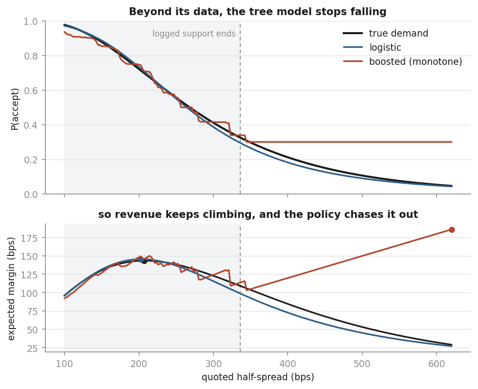
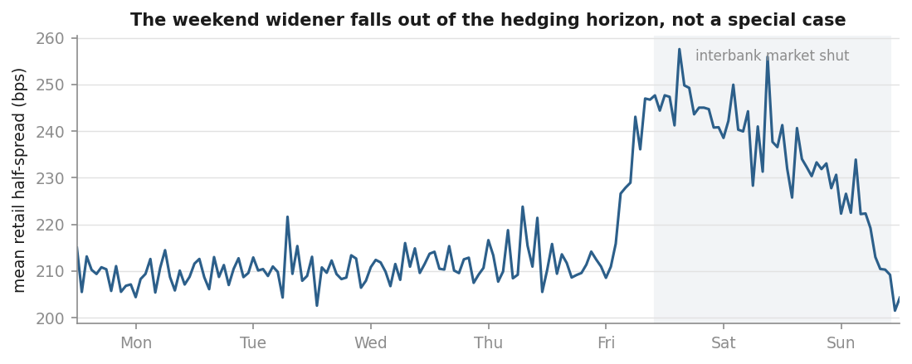
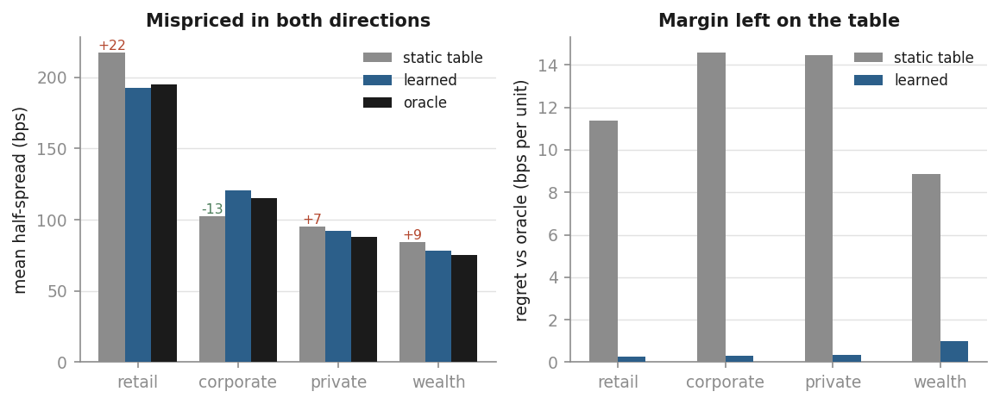
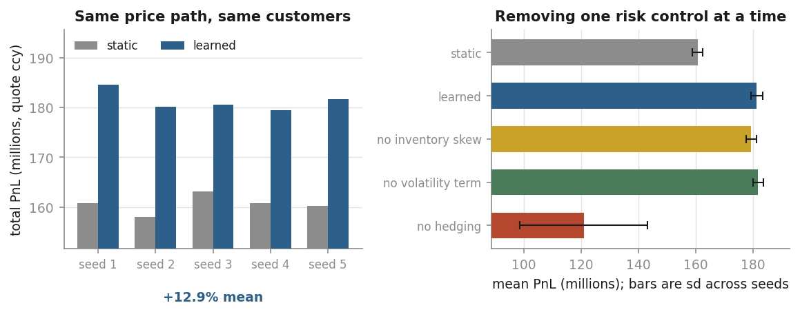
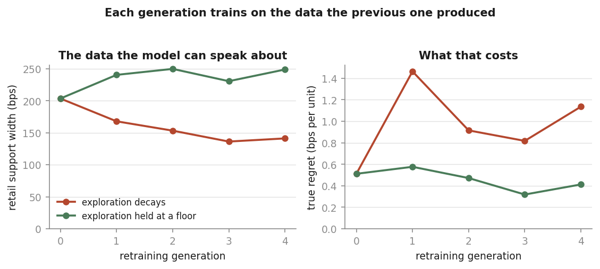

# Vane

A retail FX auto-quoter: an engine that turns an interbank mid into a
client-specific two-way price, in place of the static daily rate sheet that
Indian banks still publish.

The problem comes from a live rate snapshot taken on 6 July 2026 with interbank
USD/INR at 95.29. Every bank in the panel quoted one rate to everybody, all day:

| Provider    | Buy   | Buy margin | Sell  | Sell margin |
|-------------|-------|------------|-------|-------------|
| ICICI       | 93.31 | 208 bps    | 97.13 | 193 bps     |
| HDFC        | 92.79 | 262 bps    | 97.76 | 288 bps     |
| Kotak       | 92.55 | 288 bps    | 96.91 | 170 bps     |
| Thomas Cook | 93.79 | 157 bps    | 96.28 | 104 bps     |

A static sheet has to be wide enough for the worst case it might meet during the
day, which means it is too wide for most flow and occasionally too tight for the
rest. Vane prices each request on its own merits instead: what the desk's
inventory looks like, how volatile the pair is, how long before the position can
be hedged, and who is asking.



*A calibrated, monotonicity-constrained gradient-boosted demand model pricing
its way off the edge of its own training data — and the static-table incumbent
it was supposed to improve on. Phase 3.*

---

## Roadmap

The project is built one phase at a time. Each phase is finished and verified
before the next one starts.

**Phase 1 — the pricing core.** *(complete)*
Given a mid, a position, and a customer, work out a bid and an ask. This is the
piece of arithmetic everything else is built around, so it is written first, in
C++, with no I/O and no randomness — the same inputs always give the same
quote.

**Phase 2 — the customer simulator.** *(complete)*
Invent a stream of customers arriving through the day, each with a private idea
of what price they would accept. Quote to them, see who deals and who walks.
That is what generates the data the next phase learns from, because no such
dataset exists publicly.

**Phase 3 — the learned quoter.** *(complete)*
Fit a model of *how likely a customer is to accept a given price*, then use it
to pick the price that makes the most money: quote too wide and nobody deals,
too tight and you deal at no margin. The catch, and the interesting part, is
that you only ever find out what happened at the price you actually quoted —
never what would have happened at some other price. That has to be handled
deliberately, by jittering prices to explore and reweighting the data
afterwards.

**Phase 4 — does it actually work.** *(complete)*
Run the learned quoter and the old static rate sheet over the same simulated
flow and compare revenue, market share, and how much risk each one ends the day
holding. Then close the loop: let the deployed policy generate the data its own
successor learns from, and watch what that does.

**Phase 5 (optional) — hedging.** Route the desk's hedge orders into the Hawkes
limit-order-book simulator so the cost of hedging is modelled rather than
assumed.

---

## Phase 1: what is in here

### How a price is built

```
horizon vol      sigma_h   = sigma_daily * sqrt(hedge_horizon / 24h)

reservation      skew_bps  = -gamma * tier_mult * (inventory / limit) * sigma_h_bps
                 reserve   = mid * (1 + skew_bps / 10000)

half spread      half_bps  = tier_base + vol_coeff * sigma_h_bps + size_term
                 half_bps  = clamp(half_bps, tier_floor, tier_ceiling)
                 half_bps  = max(half_bps, cost_floor)

quote            bid       = floor(reserve * (1 - half_bps / 10000))
                 ask       = ceil (reserve * (1 + half_bps / 10000))
```

Four ideas are doing the work.

**Inventory skew.** This is the Avellaneda–Stoikov reservation price. If the
desk is long dollars it shades the *whole* price down — a worse bid and a
better ask — so the next customer is nudged into taking the position off its
hands. It moves the price; it does not widen it. The half-spread in bps is
identical at every inventory level, which the property tests assert.

**Volatility over the hedging horizon, not the clock.** The desk's risk is not
"how volatile is this pair" but "how much can it move before I can get out".
Those differ enormously, and the difference is where the weekend comes in.

**The weekend gap, derived rather than bolted on.** The interbank market closes
Friday 22:00 UTC and reopens Sunday 22:00, but retail demand does not stop. A
position taken late on Friday is carried across a 48-hour gap. `calendar.cpp`
computes the horizon accordingly, ramping it up over the last eight hours of
the week, and the widening then falls straight out of the sqrt-of-time formula
with no special case anywhere in the pricer:

```
   when            horizon h    sigma_h bps   spread bps      bid          ask
  ---------------------------------------------------------------------------
  Wed 12.00 UTC       0.50         5.77       408.7     93.34293     97.23707
  Fri 14.00 UTC       0.50         5.77       408.7     93.34293     97.23707
  Fri 18.00 UTC      24.50        40.41       460.6     93.09536     97.48464
  Fri 21.50 UTC      45.50        55.08       482.6     92.99058     97.58942
  Sat 06.00 UTC      40.50        51.96       477.9     93.01284     97.56716
  Sun 22.50 UTC       0.50         5.77       408.7     93.34293     97.23707
```



Mean retail half-spread across the trading week, measured from a six-month
simulated log. The step up begins on Friday afternoon and unwinds through
Sunday's reopen. Nothing in the pricer knows what a weekend is.

**Hard limits that produce one-sided quotes.** At the position limit the desk
stops showing the side that would make the position worse, but keeps showing
the side that unwinds it. Rejecting outright would be the easy thing to do and
the wrong one.

### Calibration

Tier defaults are set so that the retail tier reproduces the ICICI column of
the snapshot above — 200 bps base, arriving at 93.343 / 97.237 against the
published 93.31 / 97.13. The tighter tiers are the headroom the report's first
recommendation was pointing at:

```
   tier          spread bps       bid          ask      client cost/1k
  -------------------------------------------------------------------
  retail             408.7     93.34293     97.23707      1947.07
  corporate          148.7     94.58170     95.99830       708.30
  private             88.7     94.86757     95.71243       422.43
  wealth              58.7     95.01051     95.56949       279.49
```

`tier_base` is a hand-set number here, and it is the one thing Phase 3 replaces:
the learned quoter chooses that spread from a fitted demand curve instead of
from a table.

### Fixed point

Rates are `int64` in units of 1e-5, never doubles, so a quote is bit-exact and
reproducible. Rounding is directional — the bid floors, the ask ceilings — so
truncation can never quietly eat the margin.

---

## Phase 2: the customer simulator

Phase 1 could price. It had nobody to price to. Phase 2 builds the world: a
mid that moves, a competitor publishing a stale sheet, customers arriving
through the day, and a desk that accumulates the resulting position and has to
hedge it.

Its real output is a labelled dataset. Every quote shown is recorded together
with whether the client dealt, which is precisely the training signal Phase 3
needs and precisely what no public dataset contains.

### The reservation spread

Each arriving client carries a private number: the widest half-spread they
would still deal at. The desk never sees it, only whether the client dealt.

That number is anchored on what the competitor is showing, times a tier
stickiness factor. A retail traveller pays well over the specialist's rate for
a bank they already hold an account with; a wealth client barely does. This
turns the pricing gap in the internship snapshot into a *behaviour* rather than
an assumption, and it makes the demand curve analytic:

```
ln(reservation) ~ Normal(mu, s),  mu = ln(competitor) + ln(stickiness) + beta*ln(size/ref)
P(accept | delta) = Phi( (mu - ln delta) / s )
```

Two consequences matter. Bigger tickets shop harder, because `beta` is
negative. And the revenue-maximising quote can be computed exactly, so Phase 3
is scored as **regret against a known optimum** rather than merely "better than
baseline".

### Leakage is prevented structurally

The run writes two files. `events.csv` contains only what a real desk could
observe at quote time. `oracle.csv` contains the hidden reservation spread and
the true optimal quote. Phase 3 trains on the first and is graded on the
second, so it cannot accidentally learn the answer.

### Exploration is built in

The quoting policy multiplies its half-spread by log-normal jitter before the
clamps, so randomisation can never breach a commercial limit. The multiplier
and its scale are logged on every event, which is what lets Phase 3 correct for
the fact that **the outcome is only ever observed at the price actually
quoted** — never the counterfactual.

### The world

The mid diffuses only while the interbank market is open and jumps across the
weekend, with gap variance scaled above ordinary diffusion. The path is
generated on a **fixed time grid, lazily extended, never as a function of when
it is queried**. That is not a detail: an earlier version drew prices at
customer arrival times, which meant changing the flow seed silently changed the
market, and no two policies could ever have been compared on the same world.
Phase 4 depends on this.

The competitor refreshes its sheet twice a day and then goes stale, so a buyer
and a seller see different halves of it once the mid has moved — the incumbent
weakness the whole project is about.

Retail demand does not stop when the interbank market shuts, and hedging is
impossible while it is shut. Weekend flow therefore accumulates inventory that
cannot be laid off, which is exactly the exposure Phase 1's weekend widener
exists to charge for. In a four-week run the position reaches 2.17M against a
400k hedge band for this reason. Phase 4 can now measure whether the charge
actually covers the risk.

### What it finds

```
  tier         quotes    hit%   quoted   oracle   margin   best   regret
  -------------------------------------------------------------------------
  retail         5395   62.4    214.2    199.4   128.70 137.57     8.86
  corporate      1294   79.4    101.6    118.0    73.28  87.21    13.93
  private         512   66.8     94.3     89.3    55.41  69.29    13.88
  wealth          210   60.0     86.4     75.3    53.91  61.18     7.27
```



Left: what each tier was quoted, what the learned policy quotes, and what the
true optimum was. Right: the margin each leaves on the table.

The static tier table is mispriced in *both* directions: retail and wealth are
over-charged, corporate is under-charged by some 16 bps against what demand
would bear. Overall regret is 8.2% of attainable margin. That is the number
Phase 3 has to shrink, and it is a more interesting target than a flat "the
bank is too expensive" would have been.

The realised retail demand curve is the shape the learned model must recover
from labels alone:

```
  quoted half-spread      quotes    accepted
    100 -   150 bps          384     88.0%
    150 -   200 bps         3890     72.0%
    200 -   250 bps         4363     58.3%
    250 -   300 bps         1696     44.0%
    300 -   350 bps          296     33.4%
    350 -   400 bps           38     28.9%
```

---

## Phase 3: the learned quoter

The desk stops reading its spread off a table and learns one instead. Fit
`P(accept | spread, context)` from logged outcomes, then quote the spread that
maximises `(spread - cost) x P(accept)`.

Two models are fitted. Logistic regression in log-spread is the honest
baseline, and because the simulated demand is a lognormal-threshold rule it is
very nearly correctly specified. Gradient boosting is the flexible alternative
a real desk would reach for on messier data. Both carry a **hard
monotone-decreasing constraint on spread**, so raising the price can never be
predicted to raise the chance of dealing.

Both are well calibrated on a held-out *later* period — never a random split,
which would let the model train on Thursday and test on Wednesday of the same
week with the same price level on both sides:

| model | Brier | log loss | AUC | ECE | MCE |
|---|---|---|---|---|---|
| logistic | 0.1764 | 0.5236 | 0.787 | 0.0095 | 0.0283 |
| boosted  | 0.1776 | 0.5265 | 0.784 | 0.0107 | 0.0256 |

Calibration matters more than discrimination here. Revenue is
`spread x P(accept)`, so a model that ranks perfectly but is 10% off in level
will systematically misprice.

### The central result: a well-calibrated model that destroys value

The boosted model, monotone-constrained and calibrated to within about a
percentage point, produced a pricing policy that was **worse than the static
table it replaced**. It quoted retail at 265 bps against a true optimum of 195,
turning a regret of 12.1 bps per unit into 28.6.


The fit is not the problem. Trees cannot extrapolate. Beyond the widest logged
spread the prediction is whatever the last split said, held flat forever — and
because revenue is spread times that probability, a flat tail turns the
objective into a rising line with its maximum at the edge of the search grid.
The logistic model keeps falling and lands on the true optimum.

```
  spread    true P(accept)   logistic   boosted
     320        0.362         0.333      0.409
     380        0.243         0.212      0.301   <- outside logged support
     450        0.150         0.127      0.301
     550        0.076         0.066      0.301
```

Revenue is `(spread - cost) x P(accept)`. Against a flat tail that is a
straight line in spread, so the argmax runs to the edge of the grid. The
monotone constraint stopped the curve from *rising*; it did nothing about flat,
and flat is enough. An extrapolation audit shows the policy was pricing **65%
of retail flow above the logged support**.

The fix is not a better model — no amount of fitting recovers information the
data does not contain. It is to stop the policy deciding where the data cannot
support a decision, and to *report* extrapolation rather than absorb it into an
average. Restricting the search to a per-tier quantile range of logged spreads:

| model | policy | mean spread | true regret | regret reduction |
|---|---|---|---|---|
| incumbent | static table | 184.1 | 12.09 | — |
| logistic | unconstrained | 168.5 | 0.16 | 98.7% |
| logistic | in-support | 169.3 | 0.28 | 97.7% |
| boosted | unconstrained | 264.7 | 28.62 | **-136.6%** |
| boosted | in-support | 182.5 | 2.49 | 79.4% |

Across five independent seeds the effect is systematic, and the spread of
outcomes is the real finding:

| model | policy | mean reduction | sd |
|---|---|---|---|
| logistic | in-support | 97.2% | 1.1 |
| boosted | unconstrained | -42.2% | **76.7** |
| boosted | in-support | 73.3% | 4.2 |

Unconstrained boosting ranges from -142% to +45% depending on the seed. It is
not merely worse on average; it is unpredictable, which is the more serious
property for anything that would price real flow.

### Scoring a policy you never ran

The logged data was generated by the incumbent plus jitter. A new policy
proposes different spreads, and for those there are no outcomes at all. Four
estimators, in increasing order of trustworthiness:

```
  behaviour (what actually happened)   106.58
  direct  (model scoring itself)       120.17   circular, optimistic
  IPS                                  108.01   unbiased, high variance
  SNIPS                                115.24
  doubly robust                        119.82
  truth                                118.62
```

Doubly robust lands within 1% of the truth. It is right if *either* the outcome
model or the propensities are right, which is why it beats both of its parts.

The effective sample size is reported alongside, and it is the honest measure
of how far the policy has drifted from its data: 33% here, meaning two thirds
of the statistical power is gone even though the policy looks close to the
incumbent on average.

### A bug this caught

An identity has to hold: a target policy that *is* the behaviour policy must
receive importance weights of exactly one, so every estimator returns the
realised value. It did not. The target's density was being evaluated in
log-spread while the behaviour density was in log-*multiplier* — coordinates
differing by a row-varying offset. SNIPS came back 7% low on a case whose
answer was known exactly. The test that pins this identity now runs first in
the off-policy section.

---

## Phase 4: closing the loop

Phase 3 fitted a policy offline and scored it offline. That is a one-shot
experiment, and it hides the failure that matters most in deployment: **a live
policy generates the data its own successor learns from.**

### Serving the model

The demand model is fitted in Python and served in C++. `export_model.py`
writes the standardiser, the coefficients and the per-tier support bounds to a
small text file; the engine loads it, asserts the feature names match the order
it expects, and refuses the file outright if the spread coefficient is
non-negative or a scale is zero. A reordering in the research layer then fails
loudly at startup instead of silently mispricing every quote.

Parity between the two implementations is checked to 1e-12 against the
standardised linear form, and cross-checked against Python at 4.5e-11 over a
grid of contexts. Without that, a backtest measures the port rather than the
policy.

The policy chooses a spread; the *engine* still applies every clamp. A learned
policy is held to exactly the same tier floors, ceilings, cost floor and
position limits as the table it replaces, and a test asserts no learned quote
ever left its band.

### Does it beat the incumbent

Yes, and consistently. Every comparison uses common random numbers: the market,
flow and jitter seeds are fixed across policies, and because the price path
lives on a fixed grid, both policies see an identical sequence of prices and an
identical sequence of customers. A test asserts the customer sequences match
event for event, so any difference is the policy.

Five independent worlds, twelve weeks each:

| policy | spread | hit % | margin | regret | mean PnL | vs static |
|---|---|---|---|---|---|---|
| static | 181.2 | 64.7 | 109.51 | 10.03 | 160,584,498 | — |
| learned | 171.7 | 69.4 | 116.27 | 3.27 | 181,258,765 | **+12.87%** |



Both panels use a truncated axis, since every policy here is profitable and a
zero baseline would hide the differences; read the left panel as a comparison
between the pairs rather than as a picture of absolute scale. The error bars on
the right are the standard deviation across seeds, which is where the hedging
ablation shows its real cost.

The learned policy quotes about 10 bps tighter, deals with 5% more of the flow,
earns more per unit anyway, and carries a *smaller* maximum position. It wins
on every seed.

### The result that needed Phase 4 to find

Left alone, a deployed policy quotes near what it currently believes is
optimal, so it explores a narrower band of spreads than the incumbent did.
Retrain on that, and the support shrinks again. `run_phase4.py` runs the loop
explicitly — each generation trains on the data the previous one produced —
with exploration decaying after deployment, which is the natural thing to do:

```
  gen 0   support 203.5 bps   policy regret 0.51
  gen 1   support 167.9 bps   policy regret 1.46
  gen 2   support 153.3 bps   policy regret 0.92
  gen 3   support 136.3 bps   policy regret 0.82
  gen 4   support 141.2 bps   policy regret 1.14      -30.6% support
```

Holding exploration at a floor instead:

```
  gen 0   support 203.5 bps   policy regret 0.51
  gen 4   support 248.9 bps   policy regret 0.41      +22.3% support
```



The support collapses by a third, and the policy's own regret roughly doubles
while it does. Nothing crashes — the model stays well calibrated throughout
(Brier ~0.20, ECE ~0.02) — which is what makes this dangerous. Every diagnostic
a desk would normally watch looks healthy while the region the model can
actually speak about quietly shrinks around it. Combine that with a model that
extrapolates badly, which Phase 3 showed a boosted tree does, and the failure
is no longer hypothetical.

Exploration is not a cost to be minimised once the model is good. It is what
keeps the model allowed to be good.

### Ablations

Removing one risk control at a time, three seeds:

| variant | mean PnL | vs static | max position | PnL sd |
|---|---|---|---|---|
| static | 160,656,550 | — | 2,591,688 | 2,066,627 |
| learned | 181,745,156 | +13.13% | 2,253,534 | 2,010,240 |
| learned, no inventory skew | 179,809,358 | +11.92% | 2,253,534 | 1,751,310 |
| learned, no volatility term | 182,109,584 | +13.35% | 2,400,980 | 1,928,883 |
| learned, no hedging | 116,768,300 | -27.32% | 4,999,997 | 16,114,030 |

Two honest readings here.

Hedging is doing almost all of the risk work. Without it the desk earns a
*higher* margin per unit and still loses a quarter of its PnL, with an eight-fold
increase in the standard deviation across seeds — it stops being a market-making
business and becomes a directional bet.

And the volatility term looks mildly *negative* on PnL over these three seeds.
That is not enough evidence to remove it: the sample is small, the term exists
to price a tail this backtest barely samples, and its benefit should show up in
the worst weeks rather than the mean. But the honest statement is that this
backtest does not demonstrate the volatility term paying for itself, and a
larger study aimed at the tail would be needed to settle it.

---

## Verification

| | |
|---|---|
| Unit checks | 214, all passing |
| Property checks | 9 invariants over 20,000 randomised inputs each |
| Simulation checks | 249,965, all passing |
| Phase 3 checks | 56, all passing (Python) |
| Phase 4 checks | 240, all passing |
| Figure checks | 44, all passing (Python) |
| Sanitizers | clean under ASan + UBSan, all three suites |
| Mutation score | 35 / 35 injected bugs caught |
| Compiler | clean at `-Wall -Wextra -Wpedantic -Wshadow -Wconversion` |

The property tests pin the structural claims rather than worked examples:
bid < reservation < ask; spread non-decreasing in volatility and in horizon;
both sides shade down as inventory rises; skew never alters the half-spread;
tier ordering preserved for identical flow; floors and ceilings always
respected; rounding never favours the client; extreme inputs are rejected
rather than producing a bad quote.

A simulator cannot be verified by worked examples alone, since most of its
claims are distributional. Alongside the ordinary unit checks there are
statistical checks that draw large samples and compare against analytic truth
(sampler moments, realised variance of the price process against sigma-squared
times open days, empirical acceptance against the closed-form demand curve,
arrival counts against the integrated intensity, the oracle against a dense
grid), and conservation checks that rebuild the desk's position and cash from
the event log alone and assert they reconcile with what the desk reports.

`tests/mutate.py` injects thirty-five deliberate bugs — flipped skew sign,
linear time instead of sqrt, removed clamps, swapped rounding, inverted
position-limit logic, deleted weekend gap, a competitor sheet that never goes
stale, inverted price sensitivity, deleted seasonality, an inverted accept
rule, jitter that is never applied, a serving path that ignores its support
bounds or drops the standardisation — and confirms each one is caught. It works
inside a throwaway copy of the repository, so an interrupted run cannot leave
an injected bug in the tree.

Two of those mutations originally **survived**, and finding them was the point.
The stickiness test had been recomputing its expected values from the config
instead of measuring what the generator produced, and the seasonality test
compared realised arrival counts against the integral of `intensity()` — a
self-consistent check that passed happily with seasonality deleted, because
both sides changed together. Both are now written to recover the parameter from
sampled customers and assert the shape directly.

Latency is 26 ns per quote (38 M quotes/s) on one shared vCPU. The core is
pure, allocation-free and `noexcept`.

---

## Build

```sh
make            # library, both CLIs, all three test binaries
make phase3     # fit the demand models and score the learned policy
make phase4     # export the model, backtest it, run the closed loop
make figures    # regenerate docs/ figures from existing CLI output
make test       # run all suites
make sanitize   # rebuild under ASan + UBSan and run
make bench      # quote latency
make sim        # a four-week simulation with the tier breakdown
make mutate     # mutation testing (a few minutes)

python3 tests/mutate.py flow.cpp desk.cpp   # a subset
```

CMake is also supported (`cmake -B build && cmake --build build && ctest --test-dir build`).

## CLI

```sh
./build/vane-quote --mid 95.29 --inv 1500000 --tier corporate --sigma 0.006
./build/vane-quote --sweep-inventory
./build/vane-quote --sweep-week
./build/vane-quote --sweep-tier
./build/vane-quote --bench

./build/vane-sim --weeks 4 --by-tier
./build/vane-sim --weeks 8 --demand-curve
./build/vane-sim --weeks 8 --out data/run1     # writes the labelled dataset
./build/vane-sim --no-hedge --comp 60 --jitter 0.35

python3 analysis/run_phase3.py --data data/train
python3 analysis/run_phase3.py --seeds 5      # robustness across seeds
python3 analysis/test_phase3.py

python3 analysis/export_model.py --data data/train --out models/logistic.txt
./build/vane-backtest --model models/logistic.txt --seeds 5 --ablate
python3 analysis/run_phase4.py --generations 5

python3 analysis/make_figures.py --out docs
python3 analysis/test_figures.py
```

The figure layer is read-only: it reads the CSVs the CLI produces and writes
SVGs, and never regenerates data or refits anything. Every figure skips itself
with a hint if its input is absent, so the repository is still fully usable
from the command line without it.

Phase 3 needs numpy, pandas, scipy and scikit-learn.

## Layout

```
include/vane/  types.hpp  config.hpp  calendar.hpp  pricer.hpp     <- phase 1
               random.hpp  market.hpp  flow.hpp  desk.hpp  simulator.hpp
src/           core.cpp  pricer.cpp                                <- phase 1
               market.cpp  flow.cpp  desk.cpp  simulator.cpp
tests/         harness.hpp  test_unit.cpp  test_property.cpp
               test_sim.cpp  mutate.py
tools/         vane_quote.cpp  vane_sim.cpp
analysis/      vane_data.py     features and time-respecting splits  <- phase 3
               vane_demand.py   demand models and calibration
               vane_policy.py   pricing policy and off-policy evaluation
               vane_support.py  support constraints and the audit
               run_phase3.py    the experiment
               test_phase3.py   56 checks
               export_model.py  model -> C++ serving format          <- phase 4
               run_phase4.py    the closed-loop retraining experiment
               make_figures.py  static figures from existing output
               test_figures.py  44 checks
docs/          the figures embedded above (png for the README, svg for print)
```

## Known gaps

Carried into later phases rather than hidden:

- Only weekend gaps are modelled; mid-week rollover and holiday calendars are not.
- `sigma_daily` is an input, not estimated. Phase 2 supplies it from the price process.
- The competitor clamp is a heuristic, off by default, kept only so Phase 4 can
  ablate it against the learned demand curve.
- Single currency pair. Nothing in the design assumes one, but cross-pair
  inventory netting is not implemented.
- `size_term` widens with size on hedging-difficulty grounds; real desks often
  net this against a volume discount, which belongs in the tier logic.
- Volatility in the simulator is constant intraday. Arrival intensity is
  seasonal, volatility is not; a London/New York overlap bump would be more
  realistic.
- Tier mix is constant through the day. In reality corporate flow clusters in
  business hours and retail in the evening.
- The desk hedges all the way back to flat on breaching the band. A partial
  unwind to the edge of the band would be cheaper and is worth testing.
- Customers are independent draws with no memory: nobody shops around twice,
  and there is no repeat business or churn from being quoted badly.
- One currency pair, and the competitor is a single static-sheet rival rather
  than a panel.
- Only the logistic model is served in C++. The boosted model would need a tree
  exporter, and since Phase 3 showed it is the one that extrapolates badly, the
  closed-loop experiment would be more alarming with it, not less.
- The closed loop refits from scratch each generation on that generation's data
  alone. A real desk would keep a rolling window, which would slow the support
  collapse without preventing it.
- No live competitor data. The rate panel that motivated the tier calibration
  was collected by hand; a scheduled scraper would let the simulator's
  competitor track real published spreads.
- Support bounds are per tier. Per-context bounds would be tighter and would
  catch extrapolation in the interactions rather than only the margins.
- The demand model has no customer memory, matching the simulator. Real repeat
  business would make today's quote affect tomorrow's arrival.

---

## Requirements

C++20 and `make` for the engine; Python 3.10+ with numpy, pandas, scipy,
scikit-learn and matplotlib for the analysis and figure layers. No other
dependencies, and no network access at any point.

## Licence

MIT. See `LICENSE`.
